# NESSY

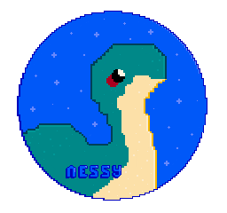

**A Nintendo Entertainment System (NES) emulator for the web**

[Play it online](https://nathsou.github.io/nessy/)

## Screenshots

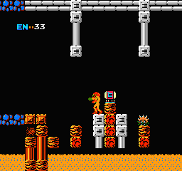
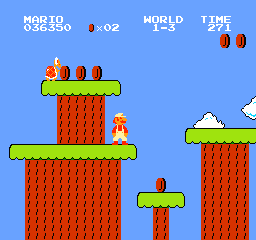
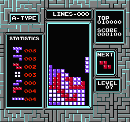

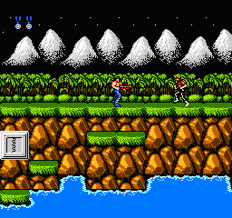
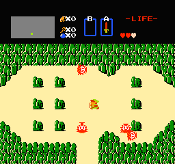
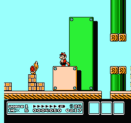

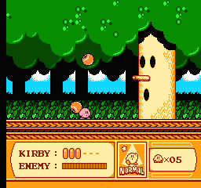
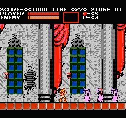
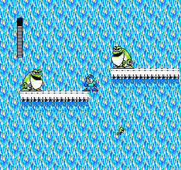

## Features

- Save states (CTRL+S to save, CTRL+L to load last)
- Customizable controls
- Full Screen mode
- Working audio
- Auto generated ROM backgrounds in the library
- Save state preview in the saves menu
- Gamepad support
- Supported mappers: [NROM](https://nesdir.github.io/mapper0.html) (0), [MMC1](https://nesdir.github.io/mapper1.html) (1), [UNROM](https://nesdir.github.io/mapper2.html) (2), [MMC3](https://nesdir.github.io/mapper4.html) (4)

## Settings Menu
Press ESC / Tab to toggle the UI

Use the arrow keys to navigate the menus and press enter to validate

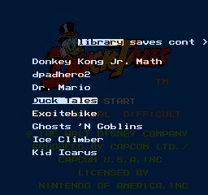

## Todo / Ideas

- Support more mappers (3, 66, 118, ...)
- Use an AudioWorkletNode instead of a scriptProcessor
- Lock framerate at 60fps even on higher refresh rate displays
- Support iNes 2.0 roms
- Support Joypad2
- Time travel mode (Save states recorded at regular intervals)
- Replay mode (Replay all inputs from the start)
- Different color palettes
- Better UX
- VR / 3D mode with sprites in front and bg tiles in the background?
- Optimize! (JIT Compiler / frame by frame or scanline by scanline rendering instead of pixel by pixel)
- Wide mode (for scrolling games, visualize the prefilled tiles in advance)
- Switch savestates to proto-buf?

## Embedding

Nessy can easily be embedded on other platforms, see the `3ds/` folder for a 3ds port (no sound and very slow frame rate for now).

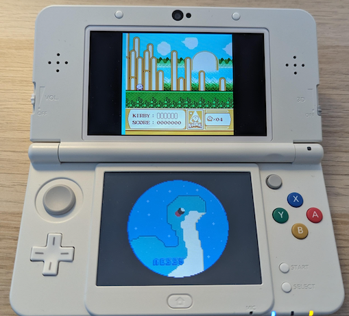