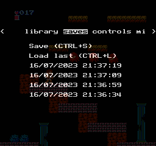

# NESSY

**A Nintendo Entertainment System (NES) emulator for the web**

## Screenshots

## Features

- Save states (CTRL+S to save, CTRL+L to load last)
- Customizable controls
- Full Screen mode
- Working audio
- Auto generated ROM backgrounds in the library
- Save state preview in the saves menu
- Supported mappers: NROM (0), MMC1 (1), UNROM (2)

## Todo / Ideas

- Support more mappers (3, 4, 118, ...)
- Reduce audio clicks (blip buffer?)
- Use an AudioWorkletNode instead of a scriptProcessor
- Support iNes 2.0 roms
- Time travel mode (Save states recorded at regular intervals)
- Replay mode (Replay all inputs from the start)
- Different color palettes
- Better UX
- VR / 3D mode with sprites in front and bg tiles in the background?
- Compile 6502 instructions to WASM directly?
